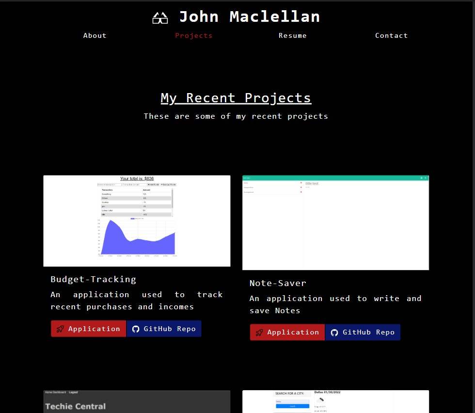

# portfolio-place

## Purpose

This webpage is a showcase of my prior works done, a source of information about me, my resume,and a way to contact me.

## Outline

- header displays navigation to other parts of page as well as my name, in case you forget.
- the about section acts as a welcome to the page, showing some pictures and a short description of myself
- the projects section showcase some of my recent works
- the resume section lists my proficiencies and includes a download link for my resume
- the contact section includes a form to email me (WIP) as well as links for my phone number and email.

## Built With

- React

## Screenshot

## Website

https://j-maclellan.github.io/portfolio-place/

## Contributors

The other contributors for the group projects are:

- wingram1
- geranv1020
- joshlyons225
